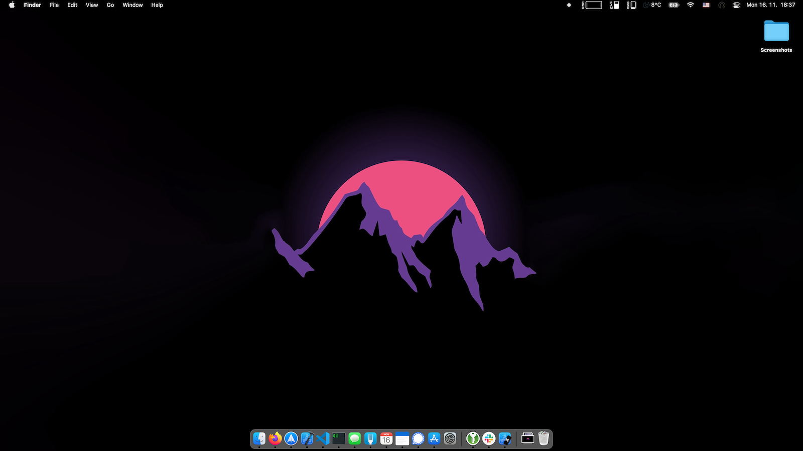
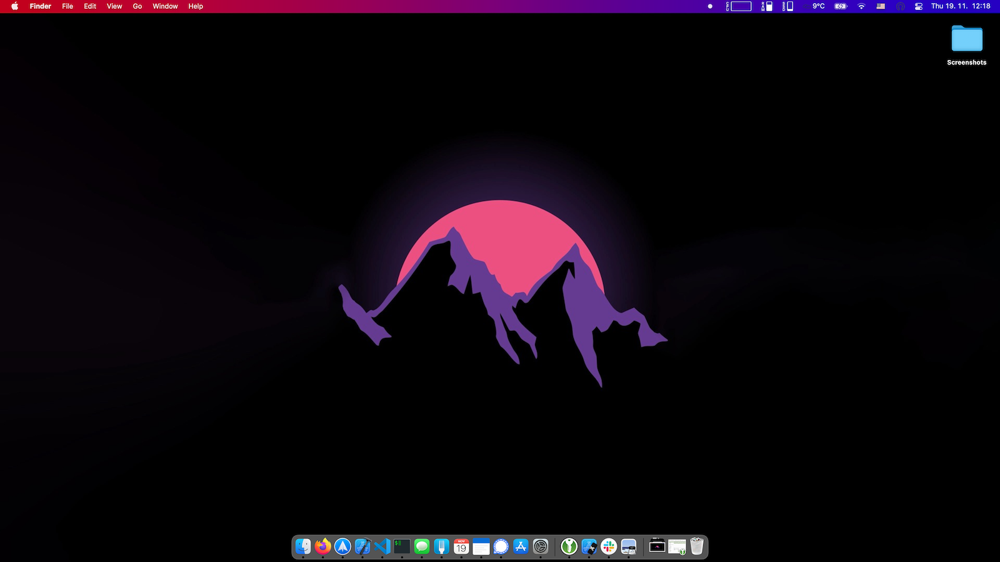

<h1 align="center"><a id="user-content-change-menu-bar-color-in-macos-big-sur" class="anchor" aria-hidden="true" href="#localization-editor"><svg class="octicon octicon-link" viewBox="0 0 16 16" version="1.1" width="16" height="16" aria-hidden="true"><path fill-rule="evenodd" d="M7.775 3.275a.75.75 0 001.06 1.06l1.25-1.25a2 2 0 112.83 2.83l-2.5 2.5a2 2 0 01-2.83 0 .75.75 0 00-1.06 1.06 3.5 3.5 0 004.95 0l2.5-2.5a3.5 3.5 0 00-4.95-4.95l-1.25 1.25zm-4.69 9.64a2 2 0 010-2.83l2.5-2.5a2 2 0 012.83 0 .75.75 0 001.06-1.06 3.5 3.5 0 00-4.95 0l-2.5 2.5a3.5 3.5 0 004.95 4.95l1.25-1.25a.75.75 0 00-1.06-1.06l-1.25 1.25a2 2 0 01-2.83 0z"></path></svg></a>Change menu bar color in macOS Big Sur</h1>

<p align="center">
   <a href="https://opensource.org/licenses/MIT">
        
    </a>
   <a href="https://camo.githubusercontent.com/e948575bb276fa2ffac99e1491d13e1ad8e28d7cc5e17153d3ea5bfa8b9784a6/68747470733a2f2f696d672e736869656c64732e696f2f62616467652f706c6174666f726d2d6d61634f532d6c69676874677265792e737667">
        
    </a>
    <a href="https://developer.apple.com/swift">
        
    </a>
    <a href="https://twitter.com/igorkulman">
        
    </a>
  <a href="https://www.buymeacoffee.com/igorkulman" target="_blank"></a>
</p>

Simple utility to change macOS Big Sur menu bar color by appending a solid color or gradient rectangle to a wallpaper image.

## Motivation

Big Sur changed the way the menu bar is displayed. It now adopts the color of the wallpaper, which may not always be what you would like. This utility allows you to specify the solid color or gradient of the menu bar you want to use.

### Example

Imagine you have a dark wallpaper ([here is mine](https://www.wallpaperflare.com/silhouette-of-mountain-simple-simple-background-minimalism-wallpaper-phxwd)). This dark wallpaper results in the menu bar being black even though you use the Light mode



With this utility you can generate a new wallpaper that makes the menu bar being shown in any color you want, like a nice tone of gray from Catalina.


Or a custom gradient



## Installation

### Binary release

Download the [latest published release](https://github.com/igorkulman/ChangeMenuBarColor/releases/latest/download/ChangeMenuBarColor.zip) and unzip the `ChangeMenuBarColor.zip` file. It will create a `ChangeMenuBarColor` executable file that you can use. 

**Make sure you execute all the commands from the directory where you unziped the files**. So if you unziped the release to a `ChangeMenuBarColor` directory you need to enter it with a `cd ChangeMenuBarColor` before running the utility.

### Swift Package Manager

You need Xcode or at least Xcode Command Line tools installed to make the utility to compile. The simplest way to install Xcode Command Line Tools is running

```bash
xcode-select --install
```

Clone the repository

```bash
git clone https://github.com/igorkulman/ChangeMenuBarColor.git
```
enter it

```bash
cd ChangeMenuBarColor
```

and run

```bash
swift build -c release
```

to create a `ChangeMenuBarColor` executable file in `.build/release`. **Ideally copy it to the project directory with**

```
cp .build/release/ChangeMenuBarColor .
```

## Usage

### Solid color

To set a new wallpaper file with a solid color rectangle that matches the menu bar, run

```swift
./ChangeMenuBarColor SolidColor "desired_hex_color" "optional_path_to_your_wallpaper" 
```

So for example

```bash
./ChangeMenuBarColor SolidColor "#CCCCCC" "/Users/igorkulman/wallpaper.jpg"
```

If you do not provide the wallpaper path

```swift
./ChangeMenuBarColor SolidColor "#CCCCCC"
```

the currently set wallpaper will be used.

### Gradient

To set a new wallpaper file with a gradient rectangle at the top, run

```swift
./ChangeMenuBarColor Gradient "start_hex_color" "end_hex_color" "optional_path_to_your_wallpaper"
```

So for example

```swift
./ChangeMenuBarColor Gradient "#FF0000" "#00FF00" "/Users/igorkulman/wallpaper.jpg"
```

If you do not provide the wallpaper path

```swift
./ChangeMenuBarColor Gradient "#FF0000" "#00FF00"
```

the currently set wallpaper will be used.

## Known issues

Dynamic wallpapers are not supported at the moment. If you use a dynamic wallpaper the utility will not be able to use it and will fail.

## Support the project

<a href="https://www.buymeacoffee.com/igorkulman" target="_blank"></a>

## Contributing

All contributions are welcomed!

### Development

Use `swift package generate-xcodeproj` to generate a Xcode project you can use for development.

## Author

- **Igor Kulman** - *Initial work* - igor@kulman.sk

## License

This project is licensed under the MIT License - see the [LICENSE](LICENSE) file for details.
